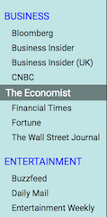

News Reader
===========

This is my capstone project for Thinkful's "Creating Web Apps with JQuery" module. This app:

1. Obtains the NEWSAPI.org-provided list of up to 70 periodicals and displays them in the left column
2. Allows the user to select one or more periodicals. Articles from the selected periodicals appear in a
summary form in the central area.
3. The user is presented with the summary information about the article. The user can perform several actions:
* expand the summary to display details about the article
* open the article in a browser tab
* delete the article from the list

*Screen Shots*

1. Periodical list 

2. Articles displayed 

3. Icons and their actions 

4. Article expanded to show details 
